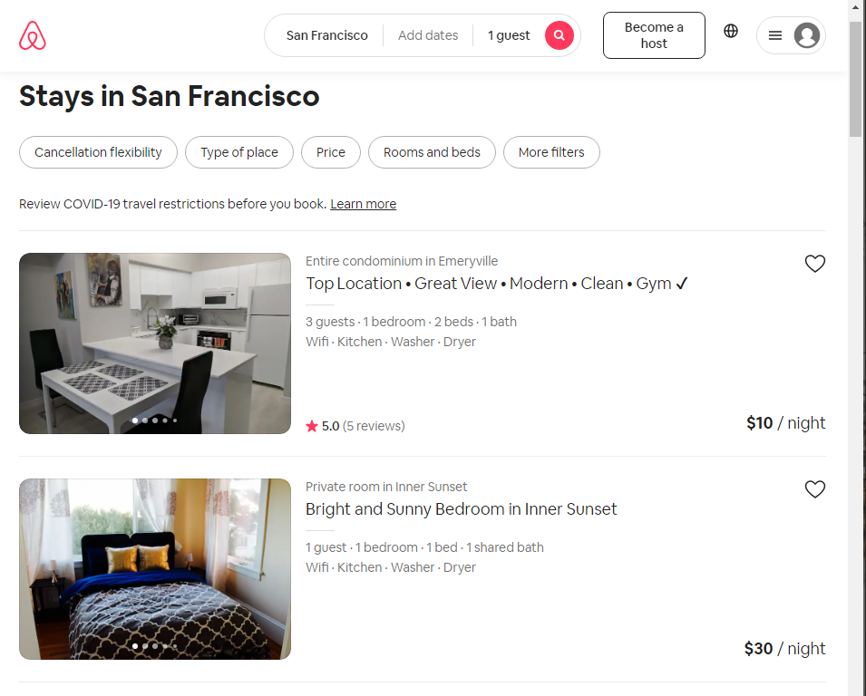

# Project 3: Design Journey

Be clear and concise in your writing. Bullets points are encouraged.

**Everything, including images, must be visible in Markdown Preview.** If it's not visible in Markdown Preview, then we won't grade it. We won't give you partial credit either. This is your warning.


## Design Plan
### Project 1 or 2
> Do you plan to reuse your Project 1 or 2 site?
> Which project?

No, I created a new site for project 3.

### Describe your Media Catalog (Milestone 1)
> What will your collection be about?
> What type of media will your site display? (images, videos, audio)

My collection will consist of rental properties in the ithaca area. Cornell offers a <a href="https://listings.offcampusliving.cornell.edu/">similar site</a>, but only for property owners willing to pay a small fee. Other websites with similar information are <a href="https://www.apartments.com/ithaca-ny/">apartments.com</a> and <a href="https://www.trulia.com/for_rent/Ithaca,NY/">Trulia</a>.

I have worked on projects in previous classes where I put together a model to predict the price of an Ithaca-area rental given a series of characteristics such as location, amenities, and size. I have code to scrape the listings from the Cornell site, and plan to write more to gather data from other sites. I am working on making improvements to the value model, and would like to explore some more advanced machine-learning techniques to do so.

My idea is to make browsing for housing as engaging and meaningfully-informative as possible. I intend to provide information about each listing, and using regression modeling, provide a "value" score for each listing based off listing characteristics. I intend to explore creative ways to display some of this data, very much inspired by sites like <a href="https://seatgeek.com/">SeatGeek</a>.

Future interactivity might include brief type-form-esque quizzes to display relevant listing as efficently as possible for each user, or categorize similar to how <a href="https://www.airbnb.com/">Airbnb</a> does for their landing page.

As this project is meant to function as a "show-case" piece, I think this approach allows for a neat way for me to combine my skills across various courses in a creative and potentially useful way.


### Audiences (Milestone 1)
> Briefly explain your site's audiences. Be specific and justify why each audience is appropriate for your site.
> You are required to have **two** audiences: "information consumers" and "site administrators"

Information Consumers
Regular User: A potential renter in the Ithaca Area. This is the target demographic of the site. For the sake of this project, this will be limited to the Ithaca area. Providing market by market value scores would be much more of a project than I am currently capable of.
Property Manager: Landlord in Ithaca Area. Needs to add, edit, and delete their own listings.

Site Administrator: Site Manager. Needs to add/edit/delete all listings.

### Personas (Milestone 1)
> Your personas must have a name and a "depiction". This can be a photo of a face or a drawing, etc.
> There is no required format for the persona.
> You may type out the persona below with bullet points or include an image of the persona. Just make sure it's easy to read the persona when previewing markdown.
> Your personas should focus on the goals, obstacles, and factors that influence behavior of each audience.

> Persona for your "consumer" audience:

Emma is a sophomore at Cornell starting to look for Jr. Year housing. She loves to window-shop online, and wants to find a cute place for her and her friends. Current options to browse housing are fragmented, confusing, and don't offer her a good way to find value. Emma is on her phone a lot, and would like to be able to browse listing on it, if possible. We need to consider load times and mobile-friendly browsing. She is plenty busy, so we should strive to present her with the most relevant listings possible, and get her to where she wants to go with minimal clicks.


> Persona for your "administrator" audience:

Kyle is an employee in the Cornell Off-Campus Living office responsible for helping get students into quality off-campus housing. He needs to be able effectively add/delete/alter any given listing, and update value model independently of listings. He has fast Cornell internet, and will be administrating from his work computer almost exclusively.

### Site Design (Milestone 1)
> Document your _entire_ design process. **We want to see iteration!**
> Show us the evolution of your design from your first idea (sketch) to the final design you plan to implement (sketch).
> Show us the process you used to organize content and plan the navigation, if applicable (card sorting).
> Plan your URLs for the site.
> Provide a brief explanation _underneath_ each design artifact. Explain what the artifact is, how it meets the goals of your personas (**refer to your personas by name**).
> Clearly label the final design.

Design Inspiration & Design Patterns:

The Cornell listing site is terribly spaced. Images are hard to discern, and it lacks visual engagement. Very little useful information is included. Why are confusing safety rating included, but not available amentities?


I do however like the way they handle filtering. I like it being collapsable, gets out of way when I don't want it.


Zillow improves spacing issues, I like the large photos for each listing, and the increased information offered.


I really like the way airbnb does featured listings. Feels browsable and honest. big pictures, and gives a good summary.


Like the use of multiple pics per listing, makes the site a lot more browsable. Amenities, price, et al. clearly listed.


I love the way seatgeek presents information. Super browsable and engaging. Seating map is responsive, and makes for a really great way to browse. Circle size --> # tickets available, color --> value. Great way to quickly find what I want.


I love this. The site shows a "view" from where the listing is, an relative location on map. Will explore if there is a way to do this with site. (update: not without external JS libraries :( ))

Sketching:

- Initial Home Design
- Large Listing Photos
- Sticky Filter Bar
- Filter by Listing tags/characteristics.
- Meets persona needs by:

- Flex-box layout for Home Page (gallery)

- Layout of individual item panel on gallery page

- Custom Dropdown Bar
- Hello, "Username"
- View User's Saved Listings
- Add Listing
- Dynamic to user type and name
- Meets persona needs by:


- Item detail card option 1


- Item detail card option 2


- Item detail card option 3

### Design Patterns (Milestone 1)
> Write a one paragraph reflection explaining how you used the design patterns in your site's design.

Filter Bar, large listing cards help site browsability, allowing Emma can quickly find, save, and act on relevant listings.

Login Form allows Emma to quickly return to her saved listings, and for Kyle to efficiently add/edit listings.


## Implementation Plan


### Requests (Milestone 1. Revise in Milestone 2)
> Identify and plan each request you will support in your design.
> List each request that you will need (e.g. view image details, view gallery, edit book, tag product, etc.)
> For each request, specify the request type (GET or POST), how you will initiate the request: (form or query string URL), and the HTTP parameters necessary for the request.


- Request: View Gallery
  - Type: GET
  - URL: /listings/details

  - Request: View Individual Listings from Gallery
  - Type: GET
  - URL: /listings/details?id=X
  - Params: id

  - Request: View Saved Listings From Dropdown
  - Type: GET
  - URL: /listings/details?saved=TRUE
  - Params: saved

  - Request: Filter Gallery by Tags
  - Type: POST
  - URL: /listings
  - Params: bed, bath, saved, rating

  - Request: Insert New Listing
  - Type: POST
  - URL: /add

  - Request: Edit Existing Listing
  - Type: POST
  - URL: /detail?id=X
  - Params: id

- Request: Delete Existing Listing
  - Type: POST
  - URL: /detail

  - Request: Save Existing Listing
  - Type: POST
  - URL: /detail?id=X
  - Params: id

  - Request: Un-save Existing Listing
  - Type: POST
  - URL: /detail?id=X
  - Params: listing_id


### Database Schema (Milestone 1. Revise in Milestone 2)
> Describe the structure of your database. You may use words or a picture. A bulleted list is probably the simplest way to do this. Make sure you include constraints for each field.

```
users
	- id INTEGER NOT NULL PRIMARY KEY AUTOINCREMENT UNIQUE,
	- username TEXT NOT NULL UNIQUE,
  - password TEXT NOT NULL,
  - name TEXT NOT NULL,
  - email TEXT,
  - phone TEXT

sessions
	- id INTEGER NOT NULL PRIMARY KEY AUTOINCREMENT UNIQUE,
	- user_id INTEGER NOT NULL,
  - session TEXT NOT NULL UNIQUE,
  - last_login TEXT NOT NULL,

 groups
  -	id INTEGER NOT NULL PRIMARY KEY AUTOINCREMENT UNIQUE,
  - name TEXT NOT NULL UNIQUE

memberships
	- id  INTEGER NOT NULL PRIMARY KEY AUTOINCREMENT UNIQUE,
  - group_id INTEGER NOT NULL,
  - user_id INTEGER NOT NULL,

listings
  -	id INTEGER NOT NULL PRIMARY KEY AUTOINCREMENT UNIQUE,
  - seller INTEGER NOT NULL,
	street_address TEXT NOT NULL,
  - price INTEGER NOT NULL,
  - bed TEXT NOT NULL,
  - bath TEXT NOT NULL,
	- sqft INTEGER NOT NULL,
	- descript TEXT NOT NULL,
  - value_score INTEGER,
  - value_rating TEXT,
  - image_ext TEXT,


saves
	- id	INTEGER NOT NULL PRIMARY KEY AUTOINCREMENT UNIQUE,
  - listing_id INTEGER NOT NULL,
  - saved_by INTEGER NOT NULL,

```
### Database Query Plan (Milestone 1. Revise in Milestone 2)
> Plan your database queries. You may use natural language, pseudocode, or SQL.

View All Listings
SELECT * FROM listings
INNER JOIN saves
  ON saves.listing_id = listings.id
INNER JOIN users
  ON users.id = listings.seller

View Individual Listing
SELECT * FROM listings
INNER JOIN saves
  ON saves.listing_id = listings.id
INNER JOIN users
  ON users.id = listings.seller
WHERE listings.id = :listing_id

View Certain Listings
SELECT DISTINCT * FROM listings
INNER JOIN saves
  ON saves.listing_id = listings.id
INNER JOIN users
  ON users.id = listings.seller
WHERE
listings.bed = :bed
AND
listings.bath = :bath
AND
saves.saved_by = :user_id
AND
value_rating = :rating


Update Existing Listing
UPDATE (...) FROM listings WHERE id = :id

Delete Existing Listing
DELETE FROM listings WHERE id = :id

Save Listing
INSERT INTO saves (...) VALUES (...)

Un-Save Listing
DELETE FROM saves WHERE listing_id = :listing_id AND saves.saved_by = :user_id

Create New Listing
INSERT INTO listings (...) VALUES (...)

### Code Planning (Milestone 1. Revise in Milestone 2)
> Plan any PHP code you'll need here using pseudocode.
> Use this space to plan out your form validation and assembling the SQL queries, etc.
> Tip: Break this up by pages. It makes it easier to plan.

```
Filter Bar

Header
Login: Check if logged in, if so display user info. If not login form.

Home
Header includes
Form validation: Make sure filter inputs are clean
Form Logic: construct query based on inputs
Show Listings: For loop over SQL query results, displaying Image of each Listing.
Footer includes

Detail
Show Listings: For loop retrieving SQL query, displaying Image of each

Edit Listing
Form Validation
Form

Add Listing
Form Validation
Form


```


## Submission

### Audience (Final Submission)
> Tell us how your final site meets the needs of the audiences. Be specific here. Tell us how you tailored your design, content, etc. to make your website usable for your personas. Refer to the personas by name.

Kept the design and straight-forward as possible, benefiting users with lower computer self efficacy, confidence, and risk tolerance. Site is easily navigable and intuitive. Click on a listing to view details, and all options are clearly presented in the form of buttons placed in proximity to each other.

Emma can filter listings by her needs, and view what she wants with minimal input. Kyle and listing managers can quickly make the changes they need and upload new listings to the site.

Implemented tag requirement as makes sense for user roles. Emma can save her favorite listings and quickly com back to them with the dynamic header. Kyle and Admins can edit any details/tags they need, and managers can change information about their own properties.


### Additional Design Justifications (Final Submission)
> If you feel like you haven’t fully explained your design choices in the final submission, or you want to explain some functions in your site (e.g., if you feel like you make a special design choice which might not meet the final requirement), you can use the additional design justifications to justify your design choices. Remember, this is place for you to justify your design choices which you haven’t covered in the design journey. You don’t need to fill out this section if you think all design choices have been well explained in the design journey.


### Self-Reflection (Final Submission)
> Reflect on what you learned during this assignment. How have you improved from Project 1? What things did you have trouble with?

Had trouble working linearly in this. Got interested by side ideas and projects that slowed development. Spent the better part of a day trying to make a CSS only carousel that I didn't end up using, and a good part of another learning some basic JS syntax.

Thought I had planned by time well, but PHP debugging and googling is not a very fast process. Worked for multiple dates cumulating in a couple days without sleep to try to meet friday deadline. After I passed, I wanted to focus on understanding content the best I could and rewriting database setup to make for more efficient queries.

I've come a long way since M1 in terms of my own skills and confidence. Feel much more confident in my ability to rapidly develop sites now, and integrate database content. Implementing PHP remains more tedious than challenging in my mind, and I don't particularly enjoy it. I really liked the design and conceptual elements of the project, and I definitely want to continue with web dev stuff in the future (so long as it uses django or another framework.)

Overall I'm proud of the site. I learned a lot from this project and the course, and feel very confident with the material.
### Grading: Mobile or Desktop (Final Submission)
> When we grade your final site, should we grade this with a mobile screen size or a desktop screen size?

Desktop

### Grading: Step-by-Step Instructions (Final Submission)
> Write step-by-step instructions for the graders.
> The project if very hard to grade if we don't understand how your site works.
> For example, you must login before you can delete.
> For each set of instructions, assume the grader is starting from /

Viewing all entries:
1. Sign into any account

View all entries for a tag:
1. Sign into any account
2. From /home gallery, use filter bar to view desired tags.

View a single entry and all the tags for that entry:
1. Sign into any account
2. Click on any entry to go to /details?id=X page.

How to insert and upload a new entry:
1. Sign into manager or admin account (UN: grader, PW: monkey)
2. From dropdown login menu, select 'add listing'
3. Complete form in /add
4. Make sure your selected image meets guidelines. Image is not sticky.

How to delete an entry:
1. Sign into Admin Account (UN: grader, PW: monkey)
2. Click on desired listing from /home
3. Click on delete listing. Refresh

How to view all tags at once:
1. Sign into any account
2. Use Filter Bar in /home to Filter by Tags
3. Set options to "All" and hit submit

How to add a tag to an existing entry:
1. Sign Into any Account
2. Click on an un-saved listing from /home gallery
3. Click "Save Listing". Refresh.

How to remove a tag from an existing entry:
1. Sign into any account
2. Click on a listing from /home gallery
3. Click "Un-Save Listing". Refresh.
